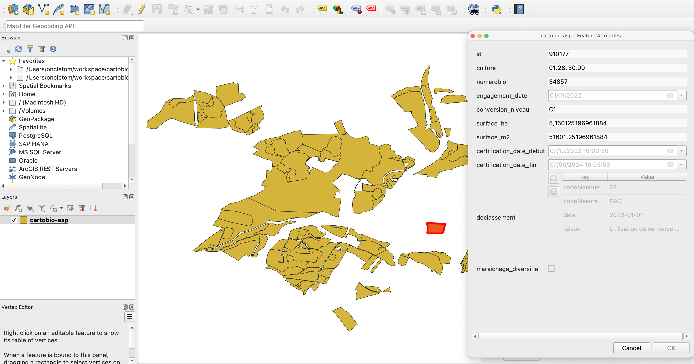

L'export contient les données des parcellaires validés
lors d'audits en Agriculture Biologique.

**Période concernée** : du 15 mai de l'année N-1 ↦ 15 mai de l'année N.

## Propriétés des _features_

| Clé                         | Type                | Exemple
| ---                         | ---                 | ---
| `maraichage_diversifie`     | Boolean             | `false`
| `engagement_date`           | Date                | `2022-01-01`
| `conversion_niveau`         | Enum [^2]           | `BIO`
| `certification_date_debut`  | DateTime            | `2022-01-01T10:00:00Z`
| `certification_date_fin`    | DateTime            | `2023-06-31T09:59:59Z`
| `declassement`              | Object (voir ci-dessous)
| `geom`                      | Geometry            |

### Sous-propriétés du champ `declassement`

Cette cellule contient les informations du déclassement le plus récent.

| Clé                 | Type          | Exemple
| ---                 | ---           | ---
| `date`              | Date          | `2022-01-01`
| `codeManquement`    | Enum [^3]     | `46`
| `codeMesure`        | Enum [^4]     | `DAC`
| `raison`            | Text          | `Utilisation de semence non-bio`

[^2]: `C1`, ou `C2`, ou `C3` ou `AB` ou `CONV`
[^3]: Nomenclature de manquement définie par l'Agence Bio/INAO
[^4]: Nomenclature des codes définie par l'Agence Bio/INAO
